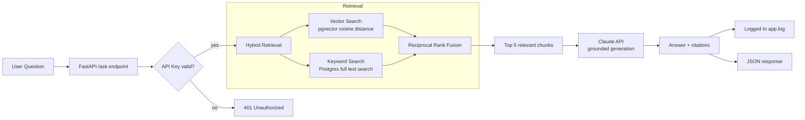

# RAG Compliance Assistant

A production RAG (Retrieval-Augmented Generation) system that answers compliance policy questions with grounded, cited answers, built and deployed end to end: chunking, embeddings, hybrid retrieval, LLM generation, evaluation, containerisation, cloud deployment, and CI/CD.

**Live demo:** http://16.61.183.194:8501
**API docs:** http://16.61.183.194:8000/docs

> Built for a fictional financial services company (Meridian Financial Services Ltd) with 20 realistic compliance policy documents, covering AML, KYC, data protection, complaints handling, fraud escalation, and more.

---

## What it does

Ask a real compliance question in plain English, get back an answer grounded strictly in the company's own policy documents, with the exact source cited, not a hallucinated guess from general knowledge.

**Example**

> **Question:** What is the timeline for reporting suspicious activity?
>
> **Answer:** Any employee with knowledge or suspicion of money laundering must submit an internal SAR report within 24 hours of the suspicion arising. The MLRO must then review the report and decide within 2 business days whether it meets the threshold for an external SAR to the NCA.
>
> **Source:** 12_sar_procedure.txt

---

## Architecture



**Data pipeline (one-time setup):**

```
Policy documents (.txt)
        |
   Chunking (recursive character splitter, metadata-enriched with document title)
        |
   Embedding (all-mpnet-base-v2, 768-dim vectors)
        |
   Stored in PostgreSQL + pgvector
```

**Deployment pipeline:**

```
Push to main
        |
   GitHub Actions: run pytest
        |
   Tests pass -> SSH into AWS EC2
        |
   git pull + docker compose up --build -d
        |
   Live app updated automatically
```

---

## Tech stack

| Layer | Technology |
|---|---|
| Backend API | Python, FastAPI, Pydantic |
| Retrieval | sentence-transformers, PostgreSQL + pgvector, hybrid search (vector + keyword) |
| Generation | Claude API (Anthropic), grounded prompting |
| Database | PostgreSQL 16 with the pgvector extension |
| Frontend | Streamlit |
| Testing | pytest |
| Containerisation | Docker, Docker Compose |
| CI/CD | GitHub Actions (automated testing and deployment on push) |
| Deployment | AWS EC2 (Ubuntu), self-managed with Docker |
| Auth | API key header authentication |

---

## Key engineering decisions

**Hybrid retrieval, not just vector search.** Pure semantic search initially struggled to distinguish between policies that share similar reporting language (for example, AML, fraud, and whistleblowing all describe "reporting within X hours"). Adding PostgreSQL full text search alongside vector search, merged with Reciprocal Rank Fusion, meaningfully improved retrieval accuracy without needing a larger embedding model.

**Metadata-enriched chunking.** Each chunk is embedded together with its parent document's title, not just its own text. This solved cases where a chunk's content alone did not contain the keywords needed to identify which policy it belonged to.

**Evaluated, not assumed.** Retrieval quality is measured with Recall@5 across a 20-question hand-built evaluation set spanning all 20 source documents, currently scoring 100%. See `evaluate_retrieval.py`.

**CPU-only PyTorch in production.** The default PyTorch install bundles several gigabytes of NVIDIA CUDA libraries that are unnecessary on a CPU-only server. The Dockerfile installs the CPU-only build explicitly, reducing image size significantly.

**Automated deployment, not manual.** A GitHub Actions pipeline runs the test suite on every push and, if it passes, deploys directly to the EC2 server over SSH. Code changes reach production without a manual login step.

---

## Project structure

```
rag-compliance-assistant/
  .github/workflows/     CI/CD pipeline
  app/
    api/                 FastAPI routes
    core/                config, auth, logging
    db/                  database connection
    models/              Pydantic schemas
    services/            chunking, retrieval, generation
  data/                  20 synthetic policy documents
  tests/                 pytest test suite
  eval_questions.py      evaluation question set
  evaluate_retrieval.py
  streamlit_app.py       frontend
  main.py                FastAPI entry point
  Dockerfile
  docker-compose.yml
  requirements.txt
```

---

## Running locally

**Prerequisites:** Python 3.11+, Docker Desktop, an Anthropic API key.

```bash
git clone https://github.com/isha-atif-dev/rag-compliance-assistant.git
cd rag-compliance-assistant

python -m venv venv
source venv/bin/activate   # Windows: venv\Scripts\Activate.ps1
pip install -r requirements.txt
```

Create a `.env` file:

```
ANTHROPIC_API_KEY=your-anthropic-key
APP_API_KEY=choose-your-own-key
DATABASE_URL=postgresql://postgres:devpassword123@db:5432/rag_compliance
```

Start everything with Docker Compose:

```bash
docker compose up --build -d
```

Load the knowledge base (first run only):

```bash
docker compose exec app python setup_db.py
docker compose exec app python store_chunks.py
```

Run the frontend:

```bash
streamlit run streamlit_app.py
```

---

## API usage

```bash
curl -X POST http://localhost:8000/ask \\
  -H "Content-Type: application/json" \\
  -H "X-API-Key: your-app-api-key" \\
  -d '{"question": "What is the timeline for reporting suspicious activity?"}'
```

**Response**

```json
{
  "answer": "...",
  "sources_available": ["12_sar_procedure.txt", "..."],
  "citations": [
    {"source": "12_sar_procedure.txt", "snippet": "..."}
  ]
}
```

Interactive API documentation (Swagger UI) is available at `/docs`.

---

## Testing and evaluation

```bash
pytest
python evaluate_retrieval.py
```

Current results: automated tests passing, Recall@5 = 100% on the evaluation set.

---

## Deployment

Deployed on a single AWS EC2 instance (Ubuntu, t3.small) in eu-west-2 (London), running the same Docker Compose setup used locally. The database runs in its own container alongside the application container, on a shared Docker network. A GitHub Actions pipeline automatically tests and redeploys the application on every push to `main`.

---

## Author

Isha Atif
[GitHub](https://github.com/isha-atif-dev)